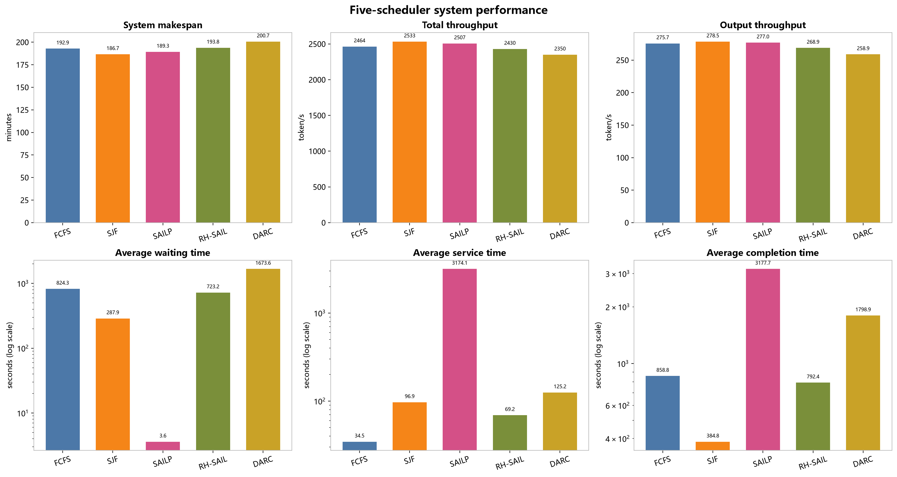
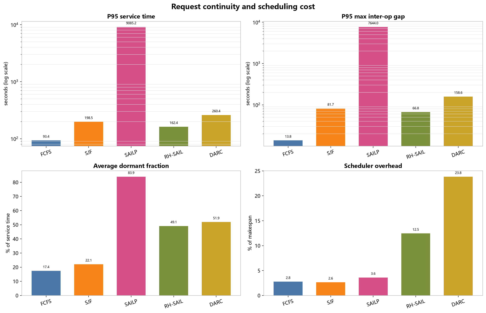
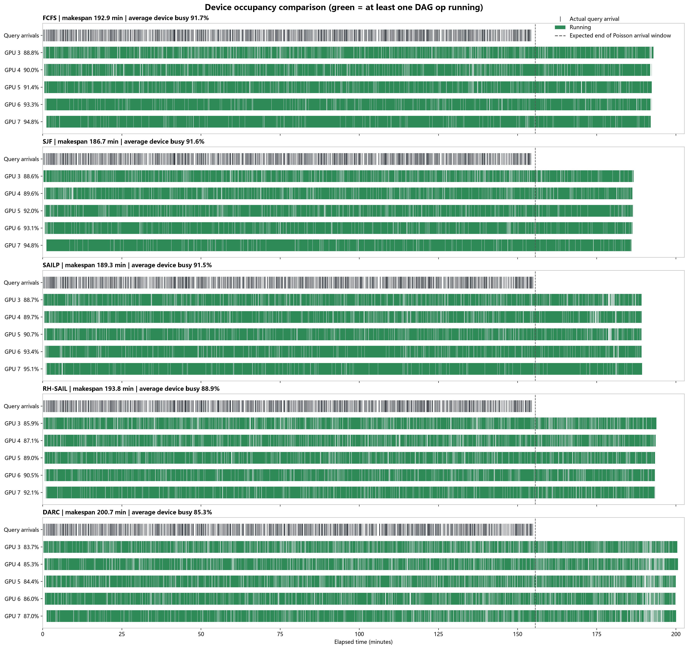
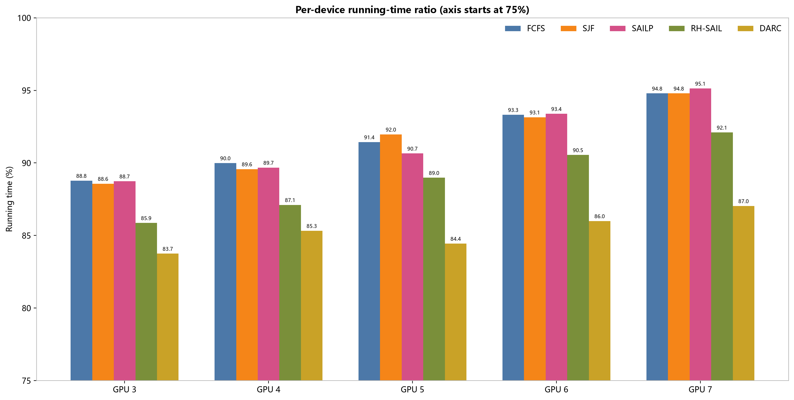
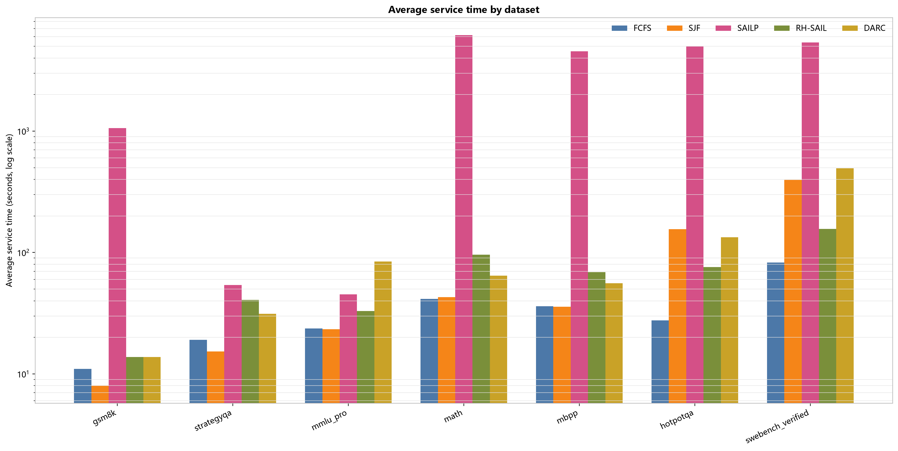
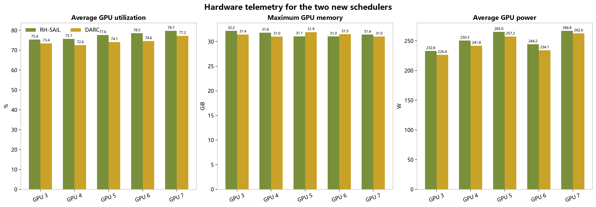

# Full first200 五种调度策略系统性能报告

## 技术结论

- 五种策略均完成 `1400/1400`，成功率 100%；日志未发现 OOM、context length、KV cache、CUDA 或 traceback 错误。
- **系统吞吐和 makespan 最优的仍是 SJF**：makespan `11199.7s`，总吞吐量 `2532.9 token/s`。新策略没有超过该系统级基线。
- **RH-SAIL 修复了 SAILP 最明显的请求搁置问题**：ready queue peak 从 `857` 降至 `33`，平均 service time 从 `3174.1s` 降至 `69.2s`，P95 最大算子间空档从 `7644.0s` 降至 `66.8s`。
- RH-SAIL 的代价是更高的首次等待和 rollout 开销；其 makespan 为 `11630.9s`，相对 FCFS `+0.50%`，调度开销占 `12.45%`。
- **DARC 当前参数表现不理想**：makespan `12039.0s`，平均完成时间 `1798.9s`，ready queue peak `468`，P95 最大算子间空档 `158.6s`。它缓解了 SAILP 的极端队列爆炸，但 admission/aging/rollout 尚未形成更好的完成时间权衡。

## 核心系统性能

| 策略 | 完成 | 系统总完成时间 | 总 tokens | 请求吞吐量 | 总 token 吞吐量 | 输出 token 吞吐量 |
| --- | --- | --- | --- | --- | --- | --- |
| FCFS | 1400/1400 | 11573.6s (192.9min) | 28,518,302 | 0.1210 req/s | 2464.1 token/s | 275.7 token/s |
| SJF | 1400/1400 | 11199.7s (186.7min) | 28,368,115 | 0.1250 req/s | 2532.9 token/s | 278.5 token/s |
| SAILP | 1400/1400 | 11358.2s (189.3min) | 28,473,524 | 0.1233 req/s | 2506.9 token/s | 277.0 token/s |
| RH-SAIL | 1400/1400 | 11630.9s (193.8min) | 28,261,861 | 0.1204 req/s | 2429.9 token/s | 268.9 token/s |
| DARC | 1400/1400 | 12039.0s (200.7min) | 28,291,199 | 0.1163 req/s | 2350.0 token/s | 258.9 token/s |

系统总完成时间衡量整批任务排空速度，token/s 衡量硬件产出。五次运行的总 token 数离散度为 `0.90%`，因此吞吐量差异同时包含调度效果和生成 token 的非确定性。

## 请求完成时间与连续性

`等待时间`是请求到达至首个 op 开始；`service time`是首个 op 开始至 DAG 完成；`完成时间 = 等待时间 + service time`。

| 策略 | 平均等待 | 平均 service | P50 service | P95 service | P99 service | 平均完成时间 |
| --- | --- | --- | --- | --- | --- | --- |
| FCFS | 824.3s | 34.5s | 25.3s | 93.4s | 149.8s | 858.8s |
| SJF | 287.9s | 96.9s | 25.9s | 198.5s | 943.8s | 384.8s |
| SAILP | 3.6s | 3174.1s | 2440.0s | 9085.2s | 10045.4s | 3177.7s |
| RH-SAIL | 723.2s | 69.2s | 59.3s | 162.4s | 216.6s | 792.4s |
| DARC | 1673.6s | 125.2s | 56.2s | 260.4s | 814.9s | 1798.9s |

请求连续性图把 service 窗口拆成实际有 op 运行的 active wall time 与没有该请求 op 运行的 dormant time。它直接检验“请求开始后是否被长期搁置”。

| 策略 | 平均 active wall | 平均 dormant | Dormant fraction | P95 最大算子间空档 | P95 service stretch |
| --- | --- | --- | --- | --- | --- |
| FCFS | 30.0s | 4.6s | 17.4% | 13.8s | 2.24x |
| SJF | 29.6s | 67.3s | 22.1% | 81.7s | 4.01x |
| SAILP | 33.5s | 3140.6s | 83.9% | 7644.0s | 477.24x |
| RH-SAIL | 32.1s | 37.0s | 49.1% | 66.8s | 5.58x |
| DARC | 30.8s | 94.4s | 51.9% | 158.6s | 12.33x |

## 调度、队列与 DAG 指标

| 策略 | Ready queue avg / peak | Dependency stall | 调度开销 | Critical path | DAG parallelism | 跨 device 依赖 | 并行利用率 |
| --- | --- | --- | --- | --- | --- | --- | --- |
| FCFS | 96.3 / 237 | 15.6s | 321.5s (2.78%) | 27.6s | 1.311 | 5.04 | 91.66% |
| SJF | 54.1 / 131 | 150.7s | 296.8s (2.65%) | 26.6s | 1.315 | 5.48 | 91.61% |
| SAILP | 185.9 / 857 | 3221.2s | 409.9s (3.61%) | 26.9s | 1.314 | 7.67 | 91.52% |
| RH-SAIL | 10.3 / 33 | 73.0s | 1448.1s (12.45%) | 26.7s | 1.312 | 6.08 | 88.92% |
| DARC | 33.7 / 468 | 123.4s | 2869.6s (23.84%) | 26.7s | 1.314 | 6.42 | 85.31% |

RH-SAIL 的 active-workflow admission 和连续推进保护显著压低了 ready queue；DARC 仍接纳了较多活跃 DAG，导致等待和尾部继续累积。调度开销是 Python 调度器累计耗时占 makespan 的比例，不包含 vLLM 推理时间。

## 相对 FCFS 的变化

| 指标 | 优选方向 | SJF vs FCFS | SAILP vs FCFS | RH-SAIL vs FCFS | DARC vs FCFS |
| --- | --- | --- | --- | --- | --- |
| 系统总完成时间 | 越低越好 | -3.23% | -1.86% | +0.50% | +4.02% |
| 总 token 吞吐量 | 越高越好 | +2.79% | +1.74% | -1.39% | -4.63% |
| 输出 token 吞吐量 | 越高越好 | +1.01% | +0.46% | -2.49% | -6.10% |
| 平均等待时间 | 越低越好 | -65.08% | -99.56% | -12.26% | +103.04% |
| 平均 service time | 越低越好 | +180.62% | +9088.71% | +100.22% | +262.49% |
| 平均完成时间 | 越低越好 | -55.19% | +270.01% | -7.73% | +109.46% |
| P95 service time | 越低越好 | +112.56% | +9630.42% | +73.98% | +178.87% |
| Ready queue peak | 越低越好 | -44.73% | +261.60% | -86.08% | +97.47% |
| Dependency stall | 越低越好 | +862.98% | +20488.66% | +366.56% | +688.71% |
| 调度开销 | 越低越好 | -7.68% | +27.50% | +350.46% | +792.67% |

百分比按 `(策略值 / FCFS - 1) × 100%` 计算。时间、队列、stall 和调度开销越低越好；吞吐量越高越好。

## Device 占用与负载

每个策略顶部的深灰刻线表示 1,400 个 query 的真实泊松到达时刻；绿色区间来自详细结果 JSON 中每个 op 的真实 start/end，表示对应 device 至少有一个 DAG op 正在运行。该图不是 `nvidia-smi` 的 SM utilization；虚线是 `1400 / 0.15` 对应的理论泊松到达窗口末端。

| Physical GPU | FCFS | SJF | SAILP | RH-SAIL | DARC |
| --- | --- | --- | --- | --- | --- |
| 3 | 88.78% | 88.57% | 88.74% | 85.86% | 83.75% |
| 4 | 89.99% | 89.57% | 89.68% | 87.11% | 85.32% |
| 5 | 91.44% | 91.97% | 90.65% | 88.98% | 84.44% |
| 6 | 93.32% | 93.15% | 93.38% | 90.55% | 86.00% |
| 7 | 94.79% | 94.79% | 95.13% | 92.10% | 87.03% |

各策略的 device busy 均较高，主要差异来自请求执行顺序、DAG 内等待和尾部排空，而不是 GPU 长时间整体空闲。

## 各数据集 Service Time

每个数据集均包含 200 个请求。对数坐标用于同时展示短 DAG 与长 DAG；跨数据集差异反映 DAG 结构、prompt 长度和生成长度的共同影响。

| Dataset | FCFS | SJF | SAILP | RH-SAIL | DARC |
| --- | --- | --- | --- | --- | --- |
| gsm8k | 11.0s | 8.0s | 1058.0s | 13.8s | 13.8s |
| strategyqa | 19.1s | 15.3s | 54.0s | 40.7s | 31.2s |
| mmlu_pro | 23.7s | 23.4s | 45.1s | 32.9s | 84.4s |
| math | 41.5s | 43.0s | 6173.8s | 96.0s | 64.4s |
| mbpp | 36.0s | 35.7s | 4535.2s | 68.8s | 55.9s |
| hotpotqa | 27.6s | 156.0s | 4979.6s | 75.8s | 133.4s |
| swebench_verified | 82.9s | 397.2s | 5373.1s | 156.2s | 493.4s |

## 新策略 GPU 硬件采样

旧三策略没有连续 `nvidia-smi` CSV，因此硬件采样仅比较同一次顺序运行中的 RH-SAIL 与 DARC。显存数值是整张卡占用；GPU 3 包含实验开始前已存在的约 1.1 GiB 其他进程显存。

| 策略 | 平均 GPU utilization | 平均 P95 utilization | 单卡最高显存 | 平均单卡功耗 |
| --- | --- | --- | --- | --- |
| RH-SAIL | 77.4% | 92.8% | 32.16 GiB | 251.8 W |
| DARC | 74.4% | 92.8% | 31.88 GiB | 244.4 W |

## 实验范围与配置

| 项目 | 配置 |
| --- | --- |
| 数据规模 | 7 个 dataset × 200 = 1,400 requests |
| 数据集 | gsm8k, strategyqa, mmlu_pro, math, mbpp, hotpotqa, swebench_verified |
| 抽样与顺序 | 长度过滤后按 seed `20260709` 随机抽样并全局打乱；五种策略使用同一 questions 文件 |
| 长度过滤 | start prompt `< 14000` tokens；start prompt + op max tokens `<= 15500` |
| 模型 | `/data2/lhy/flow/models/Llama-3.1-8B-Instruct` |
| 推理后端 | real vLLM `0.16.0`，CUDA / NVIDIA A800 |
| GPU | physical GPU `3,4,5,6,7`，共 5 张 |
| 上下文与输出 | max model len `32768`；每个 DAG op 最多 `2048` output tokens |
| GPU memory utilization | `0.75` |
| 到达过程 | Poisson `0.15 req/s`；arrival batch size `1`；seed `20260709` |
| 策略 | FCFS、SJF、SAILP、RH-SAIL、DARC |
| 代码版本 | 旧三策略 `d5d45c8`；新两策略 `ebc6b7e` |

## 方法与复现

- makespan、tokens、等待、service、队列和调度开销来自每次运行的 summary JSON。
- P50/P95/P99、请求连续性、device union busy interval 和分数据集指标由 1,400 条详细请求 JSON 重新计算。
- dormant time 使用请求全部 op 区间的时间并集计算，避免并行 op 被重复计时。
- GPU utilization、显存和功耗按 `runner.log` 中 RH-SAIL/DARC 的起止时间切分 `gpu_metrics.csv`。
- 所有派生 CSV、图表和生成脚本位于本报告相邻的 `analysis/` 与 `figures/`。

## 限制与稳健性

- 每个策略仅运行一次；当前差异是描述性结果，不能视为带置信区间的稳定排序。
- LLM 生成 token 数存在非确定性。五次运行使用相同输入与到达 seed，但总 token 数仍有 `0.90%` 离散。
- 新旧策略来自不同提交，但使用相同数据、模型、GPU 数、到达过程和内存参数；代码提交差异仍是潜在混杂因素。
- SAIL affinity 目前是软放置信号；没有可验证的跨 worker KV 状态迁移，因此不能把性能变化解释为真实 KV cache reuse 收益。
- `gpu-memory-utilization=0.75` 是 vLLM 的缓存预算参数，并非 `nvidia-smi` 整卡显存硬上限。

## 建议下一步

1. 以 RH-SAIL 为主线，先降低 rollout 调度开销，并扫描 active DAG limit、candidate K 和 rollout horizon。
2. 为 RH-SAIL 增加至少 3 个 arrival seed 的重复实验，报告均值、标准差和 P95 完成时间。
3. DARC 优先收紧 admission，增强已启动 workflow 的 completion commitment；当前版本不建议作为正式性能方案。
4. 在确认 vLLM prefix caching 可观测后，再单独做 SAIL affinity 的开关消融，区分连续性收益与真实 cache reuse 收益。

## 数据文件

- 统一指标：`analysis/scheduler_metrics.csv`
- 请求连续性：`analysis/request_continuity_metrics.csv`
- 相对 FCFS：`analysis/relative_vs_fcfs.csv`
- Device：`analysis/device_busy_comparison.csv`、`analysis/device_intervals_merged.csv`
- Dataset：`analysis/dataset_metrics.csv`
- 新策略硬件采样：`analysis/new_scheduler_gpu_hardware.csv`
- 可复现脚本：`analysis/generate_five_scheduler_report.py`
