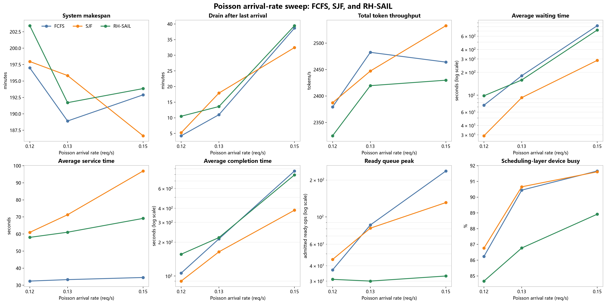
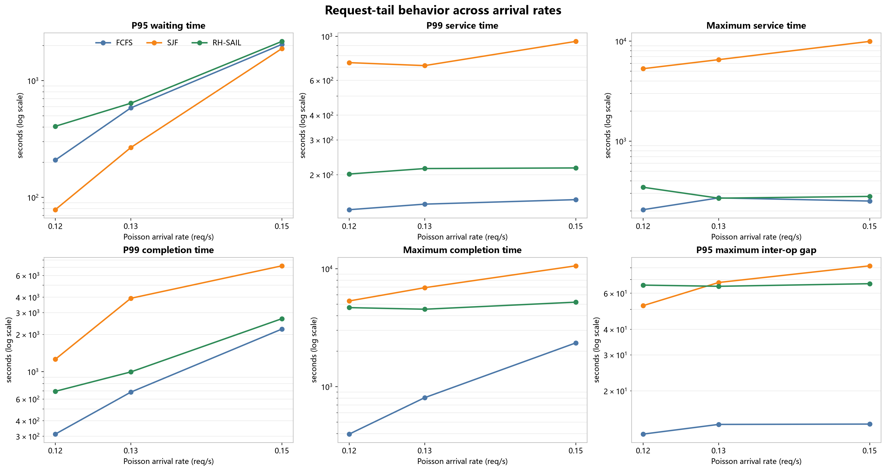
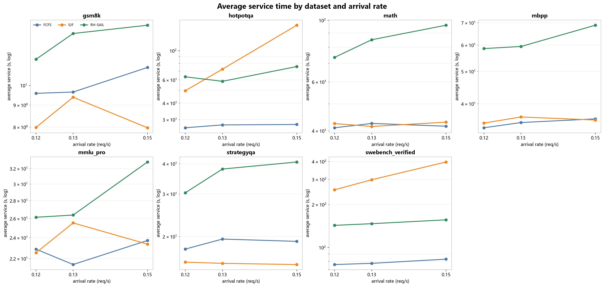
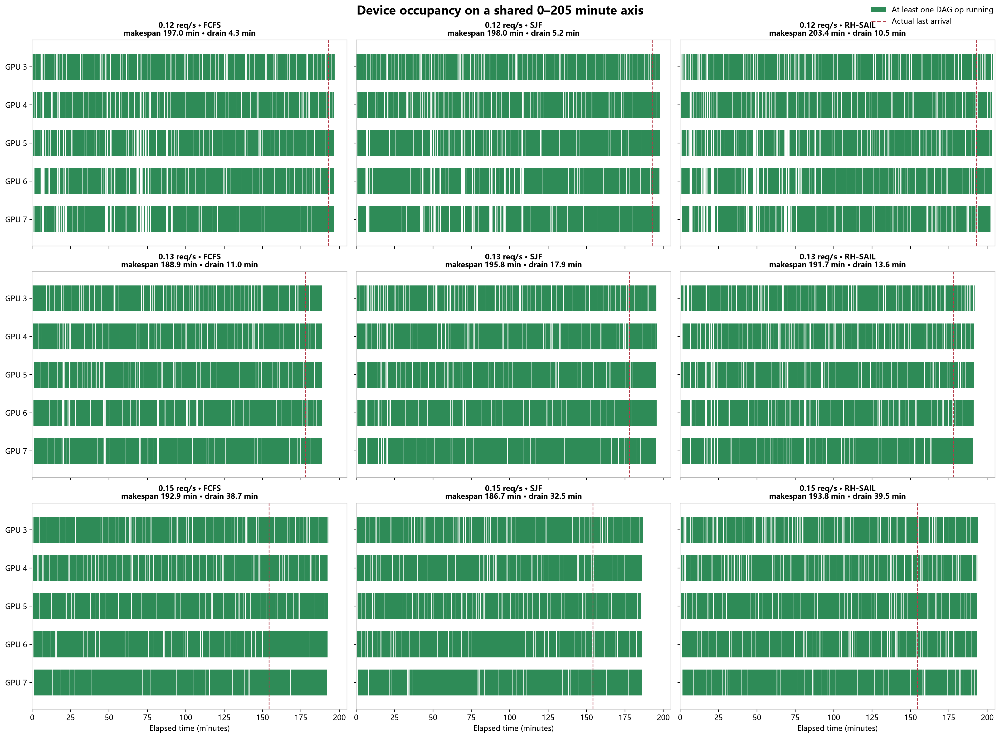
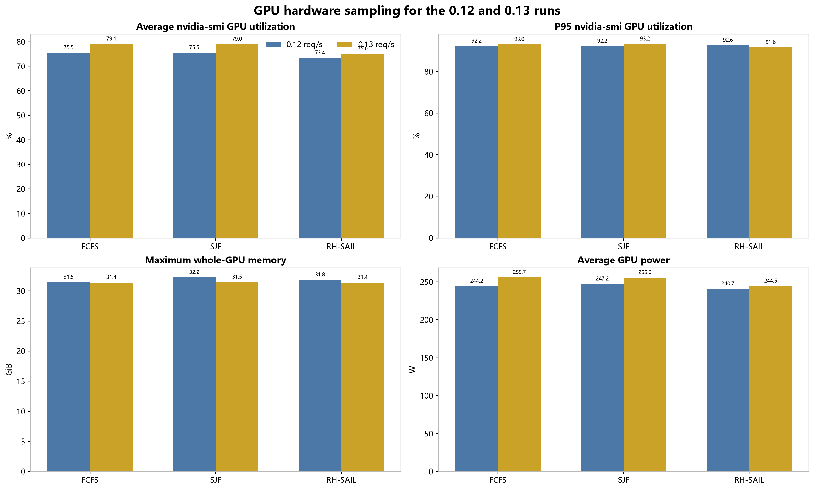
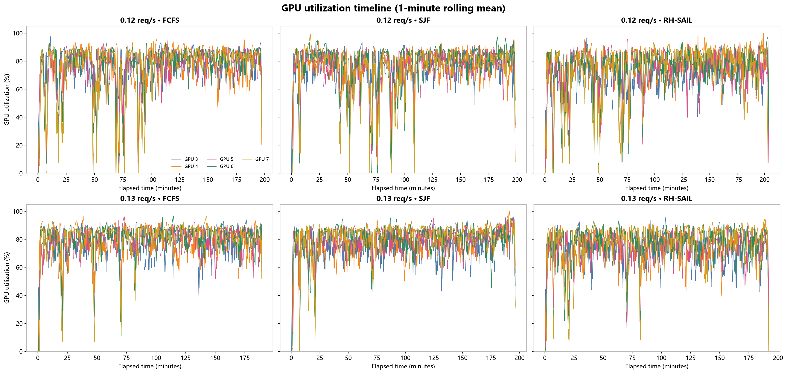

# 泊松请求到达速率实验报告

> 比较 `0.12 / 0.13 / 0.15 req/s` 下 FCFS、SJF、RH-SAIL。每个配置使用相同的 1,400 个请求、顺序和 arrival seed；本报告由请求级 JSON 与 GPU 采样重新计算。

## 技术结论

- 六个新运行均完成 `1400/1400`，成功率 100%；连同 `0.15` 参照共九组数据，未发现 OOM、context length、KV cache、CUDA 或 traceback 运行错误。
- `0.12` 是**高利用率但基本不拥塞**：到达结束后仅需 `4.3–10.5min` 排空。`0.13` 已进入**容量边界上的轻度拥塞**：尾部扩大到 `11.0–17.9min`，但仍远小于 `0.15` 的 `32.5–39.5min`。
- FCFS 是当前环境中最稳健的基线。速率从 `0.12` 增至 `0.15` 时，其平均 service 仅从 `32.4s` 增至 `34.5s`，P99 service 也只从 `133.2s` 增至 `149.8s`；恶化主要发生在首次等待，而不是请求启动后的连续性。
- SJF 在三档负载下都降低了平均等待或平均完成时间，但少量长 DAG 会被持续越过。`0.13` 的最大 service 已达到 `6529.4s`，`0.15` 进一步达到 `9942.2s`。
- RH-SAIL 没有全面超过 FCFS。它的稳定收益是相对 SJF 修复极端长尾：`0.13` 下 P99 service、最大 service 和 P99 completion 分别降低 `69.8%`、`95.9%`、`74.6%`；`0.15` 下对应降低 `77.1%`、`97.2%`、`62.7%`。
- 代价同样明确：RH-SAIL 的调度开销为约 `11%–12%`，明显高于 FCFS/SJF 的约 `2%–4%`；在 `0.12` 和 `0.13` 下，它的平均完成时间、makespan 与 token/s 均没有形成相对 FCFS 的 Pareto 改进。

## 负载分区

| 到达速率 | 实际到达窗口 | 排空尾部范围 | 平均等待范围 | 平均 device busy | 判断 |
| --- | --- | --- | --- | --- | --- |
| 0.12 | 192.8min | 4.3–10.5min | 29.2–98.2s | 84.7–86.8% | 高利用率、基本不拥塞 |
| 0.13 | 178.0min | 11.0–17.9min | 92.9–180.8s | 86.8–90.7% | 容量边界、轻度拥塞 |
| 0.15 | 154.3min | 32.5–39.5min | 287.9–824.3s | 88.9–91.7% | 明显过载 |

`0.13` 是三档中最接近“尽量用满 GPU、但到达结束后不留下很长尾部”的档位，不过它已经略高于稳态有效服务能力，不能再称为完全不拥塞。继续提高到 `0.15` 后，token/s 与 device busy 增益很小，但等待和排空尾部成倍增加。

## 核心性能

| 速率 | 策略 | 完成 | Makespan (min) | 到达结束 (min) | 排空 (min) | Token/s | 平均等待 (s) | 平均 service (s) | 平均完成 (s) | Ready avg / peak | Device busy |
| --- | --- | --- | --- | --- | --- | --- | --- | --- | --- | --- | --- |
| 0.12 | FCFS | 1400/1400 | 197.0 | 192.8 | 4.3 | 2379.3 | 73.8 | 32.4 | 106.3 | 2.7 / 37 | 86.2% |
| 0.12 | SJF | 1400/1400 | 198.0 | 192.7 | 5.2 | 2387.2 | 29.2 | 61.0 | 90.2 | 4.6 / 45 | 86.8% |
| 0.12 | RH-SAIL | 1400/1400 | 203.4 | 192.9 | 10.5 | 2324.8 | 98.2 | 58.0 | 156.3 | 2.3 / 31 | 84.7% |
| 0.13 | FCFS | 1400/1400 | 188.9 | 177.9 | 11.0 | 2482.5 | 180.8 | 33.3 | 214.1 | 15.6 / 86 | 90.4% |
| 0.13 | SJF | 1400/1400 | 195.8 | 177.9 | 17.9 | 2447.2 | 92.9 | 71.3 | 164.2 | 15.7 / 81 | 90.7% |
| 0.13 | RH-SAIL | 1400/1400 | 191.7 | 178.1 | 13.6 | 2419.6 | 158.7 | 61.1 | 219.7 | 4.5 / 30 | 86.8% |
| 0.15 | FCFS | 1400/1400 | 192.9 | 154.2 | 38.7 | 2464.1 | 824.3 | 34.5 | 858.8 | 96.3 / 237 | 91.7% |
| 0.15 | SJF | 1400/1400 | 186.7 | 154.2 | 32.5 | 2532.9 | 287.9 | 96.9 | 384.8 | 54.1 / 131 | 91.6% |
| 0.15 | RH-SAIL | 1400/1400 | 193.8 | 154.4 | 39.5 | 2429.9 | 723.2 | 69.2 | 792.4 | 10.3 / 33 | 88.9% |

Makespan 不能直接跨速率判断容量，因为较低到达速率本身会拉长实验窗口。负载判定主要看真实到达结束后的排空尾部、等待、队列和 GPU 是否已经接近饱和。

## 请求连续性与长尾

| 速率 | 策略 | P99 service | Max service | P99 completion | Max completion | P95 max gap | Dormant fraction | 调度开销 |
| --- | --- | --- | --- | --- | --- | --- | --- | --- |
| 0.12 | FCFS | 133.2 | 206.2 | 312.3 | 395.8 | 12.3 | 15.6% | 3.76% |
| 0.12 | SJF | 737.2 | 5301.3 | 1259.2 | 5329.9 | 52.2 | 19.2% | 3.72% |
| 0.12 | RH-SAIL | 201.8 | 345.7 | 693.1 | 4681.0 | 65.8 | 38.4% | 11.42% |
| 0.13 | FCFS | 142.1 | 270.4 | 682.9 | 806.6 | 13.7 | 17.2% | 2.58% |
| 0.13 | SJF | 712.2 | 6529.4 | 3923.9 | 6906.2 | 67.7 | 21.0% | 2.37% |
| 0.13 | RH-SAIL | 215.0 | 268.9 | 995.1 | 4536.1 | 64.9 | 42.7% | 11.75% |
| 0.15 | FCFS | 149.8 | 251.6 | 2211.6 | 2350.0 | 13.8 | 17.4% | 2.78% |
| 0.15 | SJF | 943.8 | 9942.2 | 7185.7 | 10586.7 | 81.7 | 22.1% | 2.65% |
| 0.15 | RH-SAIL | 216.6 | 279.9 | 2683.7 | 5207.8 | 66.8 | 49.1% | 12.45% |

FCFS 的优势来自简单、work-conserving 且保持请求级先来先服务：它几乎没有预测和 rollout 成本，也很少在请求启动后长期搁置该请求。SJF 优化平均值，但会把压力集中到少数长 DAG。RH-SAIL 的 progress commitment、gap/stretch guard 与 rollout 能修复 SJF 的极端 service 长尾，但 admission 等待和候选计算又抬高了平均值。

## RH-SAIL 的 admission 指标应如何解释

| 速率 | Active DAG limit | Admission throttle | Emergency decision | Max observed gap | Max stretch | Runtime buckets |
| --- | --- | --- | --- | --- | --- | --- |
| 0.12 | 15 | 8 | 2996 | 88.8s | 15.93x | 267 |
| 0.13 | 15 | 36 | 3623 | 89.2s | 17.97x | 259 |
| 0.15 | 15 | 54 | 4314 | 112.4s | 15.43x | 266 |

RH-SAIL 在三档速率下的 ready peak 都保持在 `30–33`，而 FCFS/SJF 随负载上升明显增大。这说明 **admission 后的活跃候选集合有界**，与 active DAG limit=`15` 的实现一致；但当前 `ready_queue` 是经过 RH-SAIL admission 过滤后的采样，不是系统原始 backlog。因此不能把“30 个 ready 节点”直接解释成系统只积压了 30 个请求，也不能与 FCFS 的 raw ready peak 作完全同义比较。下一轮应同时记录 raw ready、admitted ready、unadmitted roots 和 oldest admission wait。

当前最准确的定位是：RH-SAIL 是**高压下的有界 admission、请求连续性和 tail-fairness 保护器**，不是当前同构 GPU、关闭 prefix caching 条件下的最高吞吐调度器。

## 各数据集 Service Time

下表单元格依次为 `0.12 / 0.13 / 0.15` 的平均 service time，单位为秒；每个数据集每次运行包含 200 个请求。

| Dataset | FCFS | SJF | RH-SAIL |
| --- | --- | --- | --- |
| gsm8k | 9.6 / 9.7 / 11.0 | 8.0 / 9.4 / 8.0 | 11.5 / 13.2 / 13.8 |
| hotpotqa | 26.0 / 27.3 / 27.6 | 49.7 / 72.4 / 156.0 | 63.4 / 58.6 / 75.8 |
| math | 41.0 / 42.5 / 41.5 | 42.5 / 41.5 / 43.0 | 73.5 / 85.1 / 96.0 |
| mbpp | 33.9 / 35.1 / 36.0 | 35.0 / 36.5 / 35.7 | 58.6 / 59.4 / 68.8 |
| mmlu_pro | 22.9 / 21.5 / 23.7 | 22.5 / 25.5 / 23.4 | 26.1 / 26.4 / 32.9 |
| strategyqa | 17.7 / 19.5 / 19.1 | 15.7 / 15.5 / 15.3 | 30.3 / 38.0 / 40.7 |
| swebench_verified | 76.0 / 77.4 / 82.9 | 253.5 / 298.3 / 397.2 | 142.9 / 146.8 / 156.2 |

SJF 的极端长尾主要集中在 `swebench_verified` 等长工作流；RH-SAIL 能缩小这类请求的最坏 service，但会使若干中等 DAG 的平均 service 高于 FCFS。这也是“修复尾部但没有改善总体均值”的主要来源。

## Device 占用

绿色表示该物理 GPU 至少有一个 DAG op 正在运行，红色虚线表示该次运行真实的最后到达时刻。九个面板严格共享 `0–205min` 横轴，因此可以直接观察不同速率的到达窗口与排空尾部。

## GPU 硬件采样

完整连续的 `nvidia-smi` 采样覆盖本次 `0.12` 和 `0.13` 六个运行；旧 `0.15` 三策略实验没有同口径完整硬件 CSV，因此不伪造第三档硬件对比。调度层 device busy 与硬件 utilization 含义不同：前者由 op start/end 合并得到，后者是每 5 秒的 GPU 瞬时活动。

| 速率 | 策略 | 平均 GPU util | 平均 P95 util | 单卡最高显存 | 平均单卡功耗 |
| --- | --- | --- | --- | --- | --- |
| 0.12 | FCFS | 75.5% | 92.2% | 31.45GiB | 244.2W |
| 0.12 | SJF | 75.5% | 92.2% | 32.23GiB | 247.2W |
| 0.12 | RH-SAIL | 73.4% | 92.6% | 31.82GiB | 240.7W |
| 0.13 | FCFS | 79.1% | 93.0% | 31.41GiB | 255.7W |
| 0.13 | SJF | 79.0% | 93.2% | 31.46GiB | 255.6W |
| 0.13 | RH-SAIL | 75.0% | 91.6% | 31.41GiB | 244.5W |

## 为什么 FCFS 目前很难超过

1. 当前 5 张 GPU 同构，prefix caching 关闭，SAIL 的设备亲和与状态复用信号没有真实 KV reuse 收益。
2. vLLM 已在单个 operator 内部完成推理调度；MFE 没有 RHRS 所依赖的 prefill/decode component-level batching，因此只借用了 rollout，却没有获得其主要 batching 收益。
3. FCFS 始终向空闲 worker 提供最早的 ready op，开销低且不会因 admission 缩小可选工作集；在当前环境下，这种简单策略已经非常接近吞吐友好的工作保持策略。
4. RH-SAIL 每次进行候选构造和三步 rollout，运行时间预测仍存在误差；它主动为连续性和尾部公平付费，但这些收益目前没有转化为更好的整体吞吐。

## 下一步建议

1. 把 RH-SAIL 改成负载自适应模式：轻载使用 FCFS，只有 raw backlog、排空预测或等待持续超阈值时才启用 admission/rollout。
2. 将 candidate K 和 rollout horizon 扫描到更轻量的组合，目标把 scheduler overhead 控制到 `3%–5%`。
3. 增加 raw/admitted/unadmitted 三层队列指标，避免把 filtered ready queue 当作系统总积压。
4. 增加至少 3 个 arrival/generation seed；当前每个配置只有一次运行，1%–3% 的差异不能视为稳定提升。
5. 若要验证 SAIL/RHRS 的论文收益，需要分别开启真实 prefix caching/state reuse，并把执行接口细化到可批处理的推理组件。

## 实验配置与限制

| 项目 | 设置 |
| --- | --- |
| 数据 | 7 个数据集 × 200，共 1,400 请求 |
| 调度器 | FCFS、SJF、RH-SAIL |
| 到达过程 | Poisson，`0.12 / 0.13 / 0.15 req/s`，batch size `1`，seed `20260709` |
| 模型 | Llama-3.1-8B-Instruct，real vLLM |
| GPU | A800 physical GPU 3–7，共 5 张 |
| 上下文 | max model len `32768`，每个 op 最多输出 `2048` tokens |
| 显存参数 | `gpu-memory-utilization=0.75` |
| Prefix caching | 关闭 |

- 三档速率使用相同数据顺序和 arrival seed，但请求到达时间按速率缩放。
- 每个配置只运行一次，结论是描述性结果，尚无重复实验置信区间。
- 生成长度具有非确定性，各运行总 token 数略有差异；token/s 必须结合总 token 数解释。
- service、continuity 和 dataset 指标由请求级 JSON 重算；GPU 指标按 runner 时间窗口切分硬件采样。

## 数据文件

- 汇总指标：`analysis/rate_metrics.csv`
- 分数据集指标：`analysis/rate_dataset_metrics.csv`
- GPU 硬件汇总：`analysis/rate_gpu_hardware.csv`
- GPU 采样切片：`analysis/rate_gpu_samples.csv`
- 生成脚本：`analysis/generate_rate_sweep_report.py`
- 校验脚本：`analysis/validate_rate_sweep_report.py`
