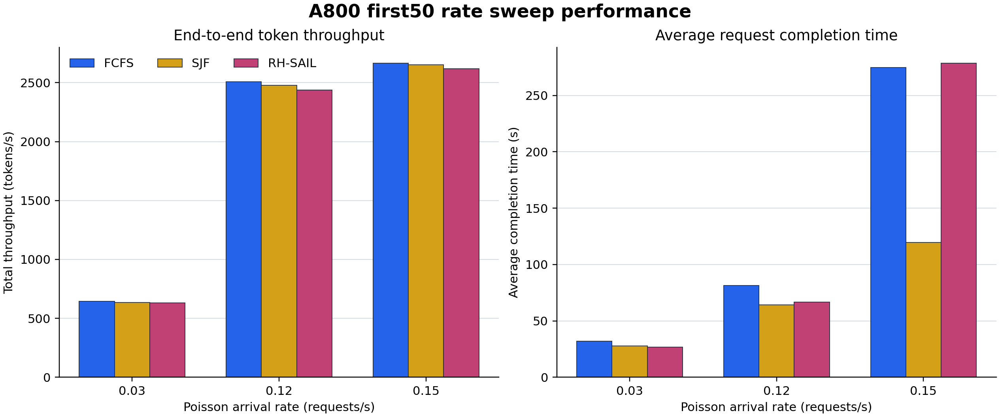

# NVIDIA A800 first50 三速率调度性能报告

## 1. 技术摘要

- **九项实验全部有效。** `0.03/0.12/0.15 req/s × FCFS/SJF/RH-SAIL` 均完成 `350/350` 请求，成功率 `100%`；runner、任务日志和结果文件中未发现 OOM、context、KV cache、Traceback、CUDA 或 NCCL 错误。
- **A800 的稳定工作区间位于 `0.12 req/s` 附近。** 此时端到端吞吐为 `2437--2509 tokens/s`，设备 busy 为 `81.8%--84.3%`，最后一次到达后仅需 `65--113s` 排空。
- **`0.15 req/s` 已越过饱和拐点。** 到达率比 `0.12` 高 `25%`，吞吐只再提高 `6.3%--7.4%`，排空尾部扩大到 `437--560s`，平均等待升至 `52.7--241.4s`。
- **FCFS 是吞吐和全局尾部最稳的基线。** 三档均取得最高总吞吐；在 `0.12/0.15` 下还具有最小 P99/Max completion 和 P95 最大 op 空档。
- **SJF 优化压力档平均值，但会饿死长请求。** `0.15` 下平均完成时间仅 `119.7s`，但 Max service 达 `2351.0s`、Max completion 达 `2521.8s`。
- **RH-SAIL 缓和 SJF 的长请求 service tail，但没有赢得吞吐。** `0.15` 下其 P99/Max service 为 `217.1/287.4s`，远低于 SJF 的 `902.5/2351.0s`；代价是平均完成时间 `278.8s`，且总吞吐比 FCFS 低 `1.9%`。

## 2. 实验设计与配置

| 项目 | 配置 |
|---|---|
| 硬件 | NVIDIA A800 × 5，GPU `3,4,5,6,7` |
| 模型 | Meta-Llama-3.1-8B-Instruct |
| 数据集 | `mixed_medium_first50.jsonl`，7 个 dataset 各 50 条，共 350 请求/策略 |
| 到达模式 | `poisson-burst`，`arrival_batch_size=1` |
| 到达率 | `0.03`、`0.12`、`0.15 req/s` |
| 到达随机种子 | `arrival_seed=20260709` |
| 策略顺序 | 每档均按 FCFS、SJF、RH-SAIL 顺序执行 |
| 推理后端 | vLLM V1，`VLLM_USE_V1=1`，`enforce_eager=1` |
| 上下文与输出 | `max_model_len=32768`，`output_max_tokens=2048` |
| 显存配置 | `gpu_memory_utilization=0.75`，prefix caching 关闭 |
| 采样 | `temperature=0.7`，`top_p=0.9`，未设置 per-request generation seed |
| GPU 采样 | `nvidia-smi`，约每 5 秒一次，按 task timeline 截取 GPU 3--7 窗口 |

三档 rate 在同一 A800 五卡环境中顺序执行，因此跨 rate 的硬件环境比 Ascend 两机实验更一致。三种策略使用相同请求集合和 arrival seed；由于生成采样未固定，实际生成内容及后续 DAG token 工作量仍有小幅差异。

## 3. 数据完整性与指标口径

本报告直接读取九组 `detailed_brief_overall.csv`、63 行 `detailed_brief_by_dataset.csv`、完整 `gpu_metrics.csv` 和 `task_timeline.csv`。分析脚本验证了：

1. 九组均为 `350/350` 且成功率为 `1.0`；63 个 dataset 分组均为 50 条请求。
2. 每行满足 `input tok/s + output tok/s = total tok/s`。
3. 每行满足 `Avg completion = Avg wait + Avg service`。
4. GPU 3--7 在九个任务窗口内均存在有效采样；实验结束后 GPU 3--7 已释放。
5. 日志错误扫描中目标错误关键词计数为 0。

指标定义：`makespan` 是首个请求到达至最后一个请求完成；`arrival end` 是首个至最后一个请求到达；`drain` 是最后一次到达后的排空时间。`run time` 为请求所有 op duration 之和；`service` 为首个 op 开始至请求完成，包含 DAG 内部空档；`completion` 为到达至完成。`device busy` 来自 worker op 活跃区间，并非 `nvidia-smi` GPU utilization。RH-SAIL 的 `ready` 只表示 admitted-ready 节点，不能等价为系统全部 backlog。

## 4. 系统吞吐与饱和拐点

| Rate | 策略 | 完成 | Makespan(s) | Arrival end(s) | Drain(s) | Total tok/s | Ready avg/peak | Device busy |
|---:|---|---:|---:|---:|---:|---:|---:|---:|
| 0.03 | FCFS | 350/350 | 11938.3 | 11930.3 | **8.0** | **645.8** | 0.0 / 9 | **22.6%** |
| 0.03 | SJF | 350/350 | **11937.7** | 11930.2 | **7.5** | 634.6 | 0.0 / 13 | 21.4% |
| 0.03 | RH-SAIL | 350/350 | 11967.1 | 11930.3 | 36.8 | 630.7 | 0.0 / 8 | 20.9% |
| 0.12 | FCFS | 350/350 | **3047.8** | 2982.6 | **65.2** | **2509.3** | 2.2 / 22 | **84.3%** |
| 0.12 | SJF | 350/350 | 3060.8 | 2982.6 | 78.2 | 2478.8 | 1.9 / 38 | 82.9% |
| 0.12 | RH-SAIL | 350/350 | 3096.1 | 2982.9 | 113.2 | 2437.4 | **1.8 / 22** | 81.8% |
| 0.15 | FCFS | 350/350 | 2854.9 | 2386.1 | 468.7 | **2666.7** | 27.8 / 63 | **90.8%** |
| 0.15 | SJF | 350/350 | **2823.0** | 2386.1 | **436.9** | 2651.0 | 18.7 / 45 | 89.8% |
| 0.15 | RH-SAIL | 350/350 | 2946.6 | 2386.7 | 559.9 | 2617.2 | **7.8 / 30** | 89.7% |

`0.03` 明显受到达过程限制：约 3.31 小时的 arrival window 主导 makespan，ready 均值接近 0，硬件采样也显示大部分时间为空闲。提高到 `0.12` 后 arrival window 缩短为约 49.7 分钟，吞吐跃升约 3.9 倍，但排空仍控制在 1--2 分钟，说明系统处于高利用且稳定的工作区间。

从 `0.12` 提升至 `0.15` 时，FCFS/SJF/RH-SAIL 的总吞吐分别只增长 `6.3%/6.9%/7.4%`，远低于到达率的 `25%` 增幅；同时 drain 分别放大 `7.2/5.6/4.9` 倍。这是比瞬时利用率更清楚的饱和证据。`0.15` 下 RH-SAIL 将 admitted-ready 峰值压到 30，但平均等待仍高达 204.6 秒，说明 admission control 将一部分压力移到 admission 之前，而不是消除 backlog。

## 5. 平均延迟与尾部公平性

| Rate | 策略 | Avg wait | Avg run | Avg service | P99/Max service | Avg completion | P99/Max completion | P95 max gap |
|---:|---|---:|---:|---:|---:|---:|---:|---:|
| 0.03 | FCFS | 3.1 | 38.5 | 28.7 | 149.9 / 225.0 | 31.8 | 193.3 / 262.6 | **0.6** |
| 0.03 | SJF | **0.2** | 36.5 | 27.5 | 128.5 / 182.5 | 27.7 | 128.7 / 182.5 | 0.7 |
| 0.03 | RH-SAIL | 0.2 | **35.7** | **26.5** | **98.7 / 161.2** | **26.7** | **98.8 / 161.4** | 0.8 |
| 0.12 | FCFS | 49.1 | 36.7 | **32.3** | **106.9 / 192.9** | 81.4 | **193.2 / 247.5** | **13.2** |
| 0.12 | SJF | **11.5** | 36.2 | 52.7 | 678.8 / 1332.2 | **64.3** | 925.1 / 1510.7 | 67.4 |
| 0.12 | RH-SAIL | 14.5 | **36.2** | 52.1 | 186.4 / 221.5 | 66.6 | 367.8 / 768.8 | 61.0 |
| 0.15 | FCFS | 241.4 | 37.0 | **33.6** | **144.2 / 220.9** | 275.0 | **534.7 / 608.8** | **13.1** |
| 0.15 | SJF | **52.7** | **36.2** | 67.0 | 902.5 / 2351.0 | **119.7** | 1633.8 / 2521.8 | 82.2 |
| 0.15 | RH-SAIL | 204.6 | 37.7 | 74.2 | 217.1 / 287.4 | 278.8 | 790.3 / 1475.4 | 66.5 |

所有数值单位均为秒。`0.12` 下，RH-SAIL 相对 SJF 将 P99/Max service 降低 `72.5%/83.4%`，Max completion 降低 `49.1%`；`0.15` 下相应 service tail 降低 `75.9%/87.8%`。这说明 continuity/admission 机制确实防止长 DAG 长时间失去执行机会。

但 RH-SAIL 在 `0.15` 的平均等待接近 FCFS，并没有把尾部保护转化为更好的全局 completion。FCFS 的自然 arrival-order aging 仍给出最强 completion tail；SJF 则以牺牲少量极长请求为代价，把大量短请求提前完成，因此平均值最好。

## 6. Dataset 级 service/run time

每个单元格为 `Avg service / Avg run`，单位为秒。run time 在策略间通常接近，而 service 的显著分化主要来自 DAG 内空档和调度顺序。

### 0.03 req/s

| Dataset | FCFS | SJF | RH-SAIL |
|---|---:|---:|---:|
| gsm8k | 6.5 / 6.0 | **6.2 / 5.9** | 6.5 / 6.2 |
| hotpotqa | 19.8 / 27.5 | **19.2 / 25.9** | 19.7 / 26.8 |
| math | 43.8 / 42.7 | 36.8 / 36.0 | **33.3 / 32.2** |
| mbpp | 31.3 / 36.5 | **30.3 / 35.8** | 30.8 / 37.1 |
| mmlu_pro | 18.5 / 29.6 | 16.0 / **22.1** | **15.2** / 22.2 |
| strategyqa | 14.2 / 17.8 | 14.3 / 18.2 | **13.5 / 16.7** |
| swebench_verified | 67.2 / 109.6 | 69.8 / 111.9 | **66.3 / 108.9** |

### 0.12 req/s

| Dataset | FCFS | SJF | RH-SAIL |
|---|---:|---:|---:|
| gsm8k | 9.8 / **6.1** | **8.3** / 6.8 | 14.9 / 8.7 |
| hotpotqa | **29.4** / 28.5 | 44.9 / 26.1 | 58.7 / **24.2** |
| math | 40.3 / 35.5 | **37.3 / 33.8** | 61.1 / 34.0 |
| mbpp | 34.6 / 36.8 | **32.9 / 35.9** | 52.0 / 37.5 |
| mmlu_pro | 19.6 / 22.2 | **18.9** / 21.6 | 22.6 / **18.8** |
| strategyqa | 17.5 / **17.5** | **16.2** / 18.1 | 24.3 / 18.0 |
| swebench_verified | **74.8 / 110.2** | 210.8 / 111.5 | 130.8 / 111.9 |

### 0.15 req/s

| Dataset | FCFS | SJF | RH-SAIL |
|---|---:|---:|---:|
| gsm8k | 10.5 / **7.0** | **9.0** / 7.1 | 18.8 / 7.2 |
| hotpotqa | **28.0 / 26.1** | 98.3 / 28.2 | 82.7 / 26.6 |
| math | **42.9** / 38.2 | 45.8 / 42.2 | 101.0 / **35.0** |
| mbpp | **32.6 / 35.1** | 35.3 / 36.7 | 66.8 / 36.7 |
| mmlu_pro | 21.1 / 23.2 | **18.8 / 18.3** | 41.9 / 23.0 |
| strategyqa | 20.1 / 18.9 | **15.7** / 17.5 | 41.1 / **17.1** |
| swebench_verified | **79.7** / 110.9 | 246.0 / **103.4** | 167.4 / 118.6 |

压力档最明显的 dataset 是 `swebench_verified`：`0.15` 下 SJF 的平均 service 为 `246.0s`，RH-SAIL 将其降至 `167.4s`，FCFS 则保持在 `79.7s`。RH-SAIL 对这类长请求比 SJF 更公平，但当前参数仍未超过 FCFS。

## 7. GPU 采样结果

| Rate | 策略 | 样本数 | Avg util | P95 util | 非零样本 | 单卡 Avg power | 峰值显存 |
|---:|---|---:|---:|---:|---:|---:|---:|
| 0.03 | FCFS | 11720 | 19.5% | 89% | 23.5% | 105.7W | 32195 MiB |
| 0.03 | SJF | 11700 | 18.9% | 89% | 22.4% | 103.7W | 33053 MiB |
| 0.03 | RH-SAIL | 11720 | 18.1% | 88% | 21.4% | 101.9W | 32617 MiB |
| 0.12 | FCFS | 2990 | 73.4% | 92% | 87.1% | 241.7W | 32175 MiB |
| 0.12 | SJF | 3005 | 72.7% | 93% | 86.2% | 237.0W | 32611 MiB |
| 0.12 | RH-SAIL | 3035 | 71.4% | 92% | 85.6% | 234.4W | 32229 MiB |
| 0.15 | FCFS | 2800 | 79.0% | 93% | 94.0% | 252.8W | 32221 MiB |
| 0.15 | SJF | 2765 | 78.1% | 93% | 92.8% | 255.1W | 33063 MiB |
| 0.15 | RH-SAIL | 2885 | 78.5% | 96% | 93.6% | 251.8W | 34552 MiB |

GPU utilization 与系统指标相互印证：`0.03` 的低均值来自长时间等待到达，而其 P95 仍接近 90%；`0.12` 已持续繁忙；`0.15` 的非零样本接近 94%，继续加压主要转化为队列和等待。三种策略峰值显存都远低于五卡总容量，且没有 OOM 迹象。

## 8. 调度结论与后续验证

1. **生产吞吐优先时，FCFS 是当前 A800 上最稳妥的默认策略。** 它在三档都取得最高 total tok/s，并在压力档拥有最强 completion tail。
2. **追求平均请求完成时间时，SJF 在高压下最有效，但必须接受长请求饥饿。** 应同时设置 age boost 或 Max service/Max gap 保护，不能只看均值。
3. **RH-SAIL 的已验证价值是 service continuity 和有界 admitted-ready。** 它显著收窄 SJF 的长请求 service tail，但需进一步优化 admission 前等待与 rollout 开销，才能转化为吞吐或全局 completion 优势。
4. **下一轮应在 `0.11--0.16 req/s` 加密采样。** 以多个 arrival seed 测出饱和曲线，并记录 total backlog、unadmitted backlog、age 和非空调度决策次数。
5. **固定生成随机性。** 当前同一 rate 内各策略 input token 相差最高约 `2.9%`、output token 相差最高约 `7.8%`；正式因果比较应使用 greedy decoding 或稳定 per-request seed。

可复现分析入口为 [`analysis/build_report_data.py`](analysis/build_report_data.py)，审计表为 [`analysis/a800_metrics.csv`](analysis/a800_metrics.csv)、[`analysis/a800_dataset_metrics.csv`](analysis/a800_dataset_metrics.csv) 和 [`analysis/a800_gpu_metrics.csv`](analysis/a800_gpu_metrics.csv)。
