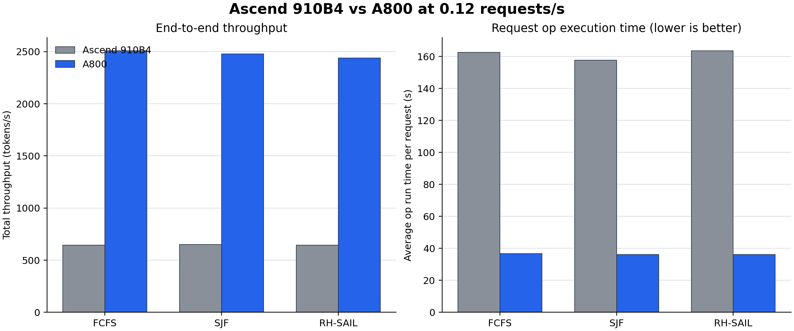

# Ascend 910B4 与 NVIDIA A800 first50 纯性能对比报告

## 1. 结论先行

- **在匹配的 `0.12 req/s` 压力档，五卡 A800 的端到端吞吐是五卡 Ascend 910B4 的 `3.79--3.89×`，平均请求 op run time 快 `4.35--4.53×`。** 两种口径方向一致，说明主要差异来自实际计算能力，而不是单一调度指标。
- **A800 把 `0.12` 从持续过载变成高利用稳定状态。** Ascend 排空需要 `8589--8946s`，A800 只需 `65--113s`，缩短 `79--135×`；因此 A800 平均完成时间低 `43--53×`。
- **`0.03` 的端到端吞吐只高 `3%--8%`，不能据此判断硬件接近。** 两边 makespan 都被相同的约 `11930s` arrival window 主导；同档 A800 的 op run time 仍快 `4.26--4.57×`，排空快 `21--121×`。
- **策略排名依赖硬件所处负载区间。** Ascend 在 `0.12` 已严重过载，SJF 的观测吞吐略高；A800 在同档可稳定排空，FCFS 吞吐最高且尾部最稳。不能把该排名变化简单归因为调度器跨硬件失效。
- **A800 `0.15` 只作为额外饱和参考。** Ascend 没有匹配的 `0.15` 数据，因此不做该档直接硬件倍率比较。

## 2. 可比较范围与实验配置

两侧均使用 Meta-Llama-3.1-8B-Instruct、`mixed_medium_first50.jsonl`、7 个 dataset 各 50 条、共 350 请求/策略，以及 FCFS/SJF/RH-SAIL 三种策略。共同关键配置为：

| 项目 | 共同配置 |
|---|---|
| 到达模式 | `poisson-burst`，batch size 1，`arrival_seed=20260709` |
| 直接比较 rate | `0.03`、`0.12 req/s` |
| 上下文与输出 | `max_model_len=32768`，`output_max_tokens=2048` |
| 缓存与执行 | prefix caching 关闭，enforce eager 开启 |
| 采样 | `temperature=0.7`，`top_p=0.9`，未设置 generation seed |
| 并行规模 | Ascend 910B4 × 5 对 NVIDIA A800 × 5 |

后端分别是 vLLM-Ascend 和 CUDA vLLM V1，软件栈与算子实现不可能完全相同，这正是端到端平台对比的一部分。Ascend 的 `0.03` 与 `0.12` 来自两台物理机器；A800 三档来自同一五卡环境。所有直接硬件倍率只使用匹配的 `0.03/0.12`。

Ascend 指标来自已审计的 [Ascend first50 报告](../20260716-ascend-poisson-rate-comparison/report.md)；A800 指标来自完整远端结果和 [A800 三速率详报](../20260717-a800-first50-rate-sweep/report.md)。对比脚本把两侧指标固化到 [`analysis/hardware_metrics.csv`](analysis/hardware_metrics.csv)，并输出 [`analysis/a800_speedups.csv`](analysis/a800_speedups.csv)。

## 3. `0.12 req/s`：A800 将持续过载变成稳定高利用

| 策略 | 硬件 | Makespan(s) | Drain(s) | Total tok/s | Avg run(s) | Avg wait(s) | Avg completion(s) |
|---|---|---:|---:|---:|---:|---:|---:|
| FCFS | Ascend 910B4 | 11805.4 | 8822.8 | 645.6 | 162.7 | 4194.6 | 4333.2 |
| FCFS | A800 | **3047.8** | **65.2** | **2509.3** | **36.7** | **49.1** | **81.4** |
| SJF | Ascend 910B4 | 11571.0 | 8588.5 | 650.4 | 157.8 | 2548.2 | 2772.4 |
| SJF | A800 | **3060.8** | **78.2** | **2478.8** | **36.2** | **11.5** | **64.3** |
| RH-SAIL | Ascend 910B4 | 11928.4 | 8945.7 | 643.8 | 163.7 | 2822.1 | 2995.2 |
| RH-SAIL | A800 | **3096.1** | **113.2** | **2437.4** | **36.2** | **14.5** | **66.6** |

| 策略 | Tok/s 加速 | Avg run 加速 | Makespan 缩短 | Drain 缩短 | Avg completion 降低 |
|---|---:|---:|---:|---:|---:|
| FCFS | **3.89×** | 4.43× | **3.87×** | **135.39×** | **53.23×** |
| SJF | 3.81× | 4.35× | 3.78× | 109.87× | 43.14× |
| RH-SAIL | 3.79× | **4.53×** | 3.85× | 79.00× | 44.97× |

Ascend 三策略的 total tok/s 聚集在 `644--650`，device busy 为 `95.5%--96.5%`，最后请求到达后还需约 2.4 小时排空，表明 `0.12` 已远高于五卡 910B4 的服务能力。A800 同档 total tok/s 为 `2437--2509`，worker device busy 为 `81.8%--84.3%`，排空只需 1--2 分钟，仍留有一定瞬时余量。

平均 completion 的 `43--53×` 差距不是单请求计算本身快这么多，而是 `4.35--4.53×` 计算优势改变了排队系统的工作区间：Ascend 上请求长期积压，A800 上到达速率仍低于或接近可持续服务率。因此，硬件容量规划应同时看 run time、throughput 和 drain，不能只看平均 latency 的表面倍率。

## 4. `0.03 req/s`：arrival window 掩盖硬件差距

| 策略 | Ascend tok/s | A800 tok/s | Tok/s 加速 | Avg run 加速 | Ascend/A800 drain | Avg completion 降低 |
|---|---:|---:|---:|---:|---:|---:|
| FCFS | 598.1 | 645.8 | **1.08×** | 4.26× | **121.38×** | 9.72× |
| SJF | **614.9** | 634.6 | 1.03× | 4.30× | 32.11× | 8.57× |
| RH-SAIL | 598.8 | 630.7 | 1.05× | **4.57×** | 20.88× | **13.13×** |

两侧使用相同的 arrival seed，最后请求均在约 `11930s` 到达。端到端 tok/s 的分母因此主要是固定到达窗口：即使 A800 很早处理完已到达请求，也必须等待后续请求出现，吞吐无法按硬件计算倍率增长。

`Avg run` 是更干净的低负载计算证据：Ascend 为 `157--164s`，A800 为 `35.7--38.5s`。排空也从 Ascend 的 `242--973s` 降为 A800 的 `7.5--36.8s`。因此 `0.03` 的正确结论是“A800 计算快约 4.3--4.6 倍，但系统吞吐受 arrival 限制”，而不是“两种硬件吞吐接近”。

## 5. 调度策略在两种硬件上的表现

### FCFS

FCFS 在 A800 三档均取得最高 total tok/s，并在 `0.12/0.15` 保持最好的 completion tail。其自然 arrival-order aging 对长短差异大的 DAG workload 很有效。Ascend `0.12` 的 FCFS 均值较差，是因为全局 backlog 达到数百请求，而非单请求 service 较差；它在 Ascend 上仍有最强 P99/Max completion。

### SJF

SJF 在两种硬件的压力档都显著降低平均等待，但都会放大长请求 service tail。Ascend `0.12` 的 Max service 为 `7331.2s`；A800 `0.15` 为 `2351.0s`。SJF 的小幅吞吐优势或劣势还混有实际 token 工作量差异，不宜做百分点级因果归因。

### RH-SAIL

RH-SAIL 在两侧都能把 admitted-ready 集合控制得较小，并相对 SJF 改善长请求 service tail。它尚未在任一硬件上稳定赢得系统吞吐或全局 completion tail。A800 `0.15` 的 ready `7.8/30` 明显低于 FCFS `27.8/63`，但平均等待仍为 `204.6s`，再次说明 admission 前 backlog 必须单独观测。

## 6. A800 `0.15` 饱和参考

| 策略 | Total tok/s | Drain(s) | Avg wait(s) | Avg completion(s) | GPU Avg util | GPU 非零样本 |
|---|---:|---:|---:|---:|---:|---:|
| FCFS | **2666.7** | 468.7 | 241.4 | 275.0 | 79.0% | 94.0% |
| SJF | 2651.0 | **436.9** | **52.7** | **119.7** | 78.1% | 92.8% |
| RH-SAIL | 2617.2 | 559.9 | 204.6 | 278.8 | 78.5% | 93.6% |

相对 A800 `0.12`，到达率增加 25%，吞吐只增加 `6.3%--7.4%`，drain 扩大 `4.9--7.2×`。这表明五卡 A800 的当前 workload 饱和点位于 `0.12` 与 `0.15 req/s` 之间。由于没有 Ascend `0.15`，本节只用于 A800 容量曲线，不产生硬件倍率。

## 7. 数据质量、限制与可用结论

1. **单次运行。** 每个 rate/scheduler 只有一个 arrival seed，无法估计方差；`1%--5%` 的策略差异只能视为描述性结果。
2. **生成随机性未固定。** 同一 A800 rate 内 input token 相差最高约 `2.9%`，output token 相差最高约 `7.8%`；两侧 output tok/s 与 total tok/s 都受工作量差异影响。Avg run 的 `4.3--4.6×` 跨策略一致性是更强的硬件证据。
3. **软件栈不同。** 报告比较的是五卡端到端推理平台，不是芯片峰值 FLOPS；结果包含 vLLM、vLLM-Ascend、CUDA/CANN、通信和算子实现差异。
4. **Ascend rate 与机器绑定。** Ascend `0.03/0.12` 来自不同物理机，跨 rate 结论存在机器混杂；同 rate 的 NPU/A800 大倍率差异仍足以支持容量判断。
5. **GPU 与 NPU 利用率口径不完全一致。** 直接硬件结论以完成数、run time、throughput、makespan 和 drain 为主，硬件采样仅作辅助解释。

在这些限制下，可以稳健使用的结论是：

> 对当前 first50 DAG workload，五卡 A800 的单请求 op 执行能力约为五卡 Ascend 910B4 的 `4.3--4.6×`；这一能力差距使 `0.12 req/s` 从 Ascend 上的持续过载变为 A800 上可快速排空的稳定高利用状态，并带来约 `3.8×` 的端到端吞吐和两个数量级的排空优势。
